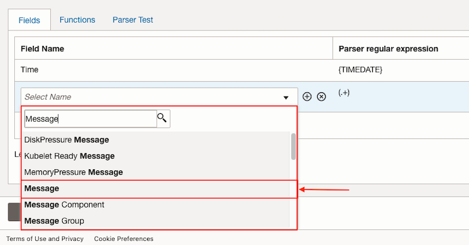
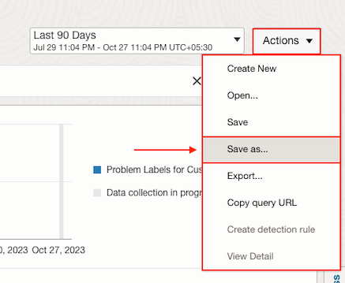
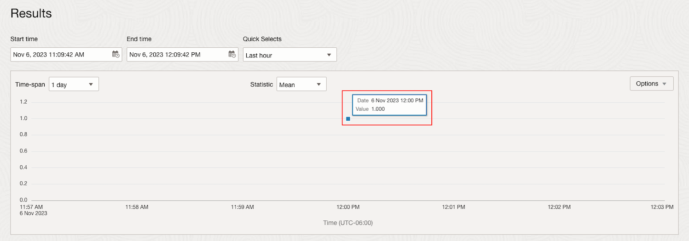
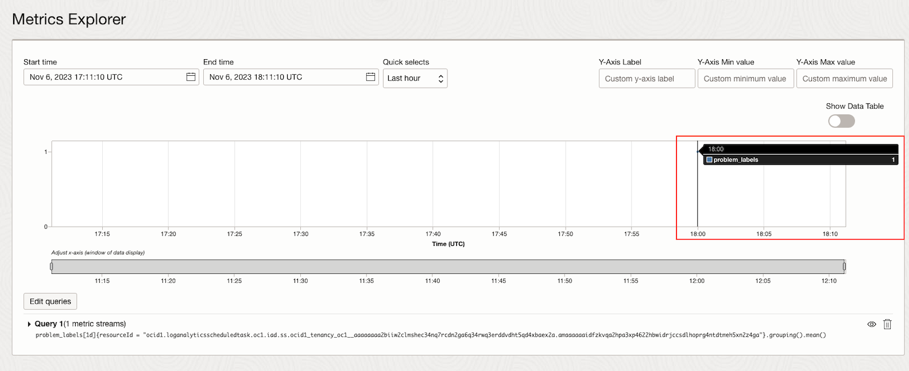
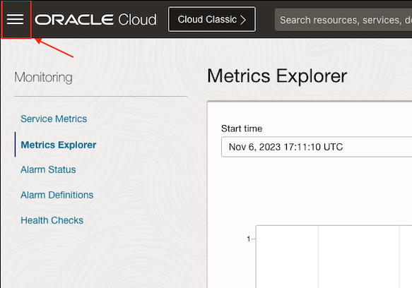
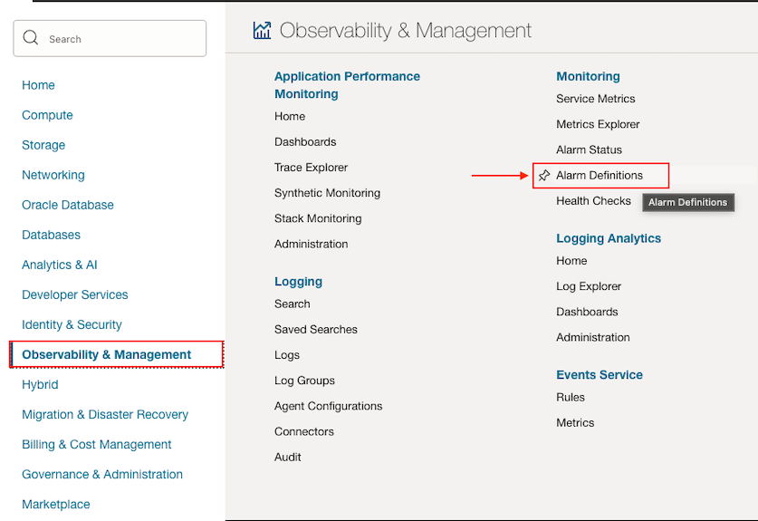

# How can I setup alerts for occurrences of critical event signatures in custom application logs using Logging Analytics?

Duration: 10 minutes

## Create Parser

1. Navigate to **Parsers**.

2. Click on **Create Parser** and select **Regex Type**.

3. Then click on **Advanced**.

4. Specify a **Name** and **Description (optional)**.

5. Add the following to **Example Base Field Content**.
      ```Example base field content
         <copy>Jan 04 21:03:24 XXXX_F5_DMZXX err dcc[11457]: 9999999999:9: [SECEV] Request blocked, violations: Web scraping detected. HTTP protocol compliance sub violations: N/A. Evasion techniques sub violations: N/A. Web services security sub violations: N/A. Virus name: N/A. Support id: 99999999999999999, source ip: 192.168.1.100, xff ip: N/A, source port: 99999, destination ip: 203.128.45.67, destination port: 999, route_domain: 200, HTTP classifier: /Common/www.xxxxxxxxx.yy.http, scheme HTTPS, geographic location: <RU>, request: <GET /ns/xxxxxx.yyy?id_seccion=9999 HTTP/1.1\r\nContent-Length: 0\r\nCookie: XXXXXXXX_XXXXXXXXX=d8b78f937f6f9d569cda500fd5cae49>, username: <8117.1533970714@MAILCATCH.COM>, session_id: <d9ba5ea0f4e98df0></copy>
      ```
      

6. Specify the following regular expression at **Parser regular expression**.
      ```Regular expression
         <copy>{TIMEDATE}\s+(.+)</copy>
      ```
      

7. Select **Message** for the second field.
   

8. To verify the fields are matching with the example logs we provided, click on **Parser Test** and then on **Run Test**.

9. Click on **Create Parser**.

## Create User Defined Source

1. Refer to [Sprint: How to create a user defined Source?](?lab=sprint-create-source)

   Select **File** as **Source Type** and **Network Firewall** at **Entity Types**. Specify the parser we created previously.

## Add Extended Fields

1. Click on **Extended Fields** and on **Add**.
   

2. Select **Message** as **Base Field**.

3. Add the following to **Example Base Field Content**.
      ```Example base field content
         <copy>XXXX_F5_DMZXX err dcc[11457]: 9999999999:9: [SECEV] Request blocked, violations: Web scraping detected. HTTP protocol compliance sub violations: N/A. Evasion techniques sub violations: N/A. Web services security sub violations: N/A. Virus name: N/A. Support id: 99999999999999999, source ip: 192.168.1.100, xff ip: N/A, source port: 99999, destination ip: 203.128.45.67, destination port: 999, route_domain: 200, HTTP classifier: /Common/www.xxxxxxxxx.yy.http, scheme HTTPS, geographic location: <RU>, request: <GET /ns/xxxxxx.yyy?id_seccion=9999 HTTP/1.1\r\nContent-Length: 0\r\nCookie: XXXXXXXX_XXXXXXXXX=d8b78f937f6f9d569cda500fd5cae49>, username: <8117.1533970714@MAILCATCH.COM>, session_id: <d9ba5ea0f4e98df0></copy>
      ```

4. For **Extract Expression** set the following regular expression.
      ```Regular expression
         <copy>source ip:?\s{Source IP:[0-9]{1,3}\.[0-9]{1,3}\.[0-9]{1,3}\.[0-9]{1,3}}</copy>
      ```

5. Click on **Test Definition** to verify the match succeeded.

6. Then click on **Add**.

## Add Labels

1. Click on **Labels** and on **Add conditional label**.
   

2. Select **Source IP** as **Input Field** and **Not In** as **Operator**. Add the following IPv4 addresses to **Condition Value**.
      ```IPv4 addresses
         192.168.1.101, 192.168.1.102, 192.168.1.103
      ```
      

3. At **Select labels** select **Security Problem** label.
   

4. Click on **Add**.

5. Then click on **Create Source**.

## Upload logs file

1. Refer to [Sprint: How to upload Files into a Source from the OCI console?](?lab=sprint-upload-log-file)

   Upload logs using the file generated by following Python script. You can use your **OCI Cloud Shell** to run the script.
      ```Python script
         <copy>python <(curl -s https://raw.githubusercontent.com/oracle-quickstart/oci-observability-and-management/master/utils/f5-firewall-logs.py)</copy>
      ```

   Then upload the generated logs file running the following Python script. Use the **Log Source** created previously.
      ```Python script
         <copy>python <(curl -s https://raw.githubusercontent.com/oracle-quickstart/oci-observability-and-management/master/utils/upload-logs-file-to-oci.py) -f f5-firewall-logs.log -s f5-firewall-logs -l "<Name of the Log Source created>" -n f5-firewall-logs</copy>
      ```

## Create a new Log Search

1. Navigate to **Log Explorer**.

2. For this lab, we are going to save a query using **extract** command to add a new field from an existing one. In this case, we want to add a new field derived from the **Message** to obtain the **Destination IP**.
  Type the following query in the text input.
      ```Query
         <copy>'Log Source' = '<Name of the Log Source created>' | extract field = Message 'destination ip:?\s(?P<Destination IP>[0-9]{1,3}\.[0-9]{1,3}\.[0-9]{1,3}\.[0-9]{1,3})' | timestats count as logrecords by 'Log Source'</copy>
      ```
      

3. Click on **Run** and see the results below.

4. Then click on **Save as...** option inside **Actions** drop-down menu.
   

5. Select a **Saved Search Compartment**. Specify the **Search Name** and the **Search Description (optional)**.

6. Click on **Save** button.

## Create Scheduled search detection rule

1. Refer to [Sprint: How to create scheduled search detection rules?](?lab=sprint-create-scheduled-search-detection-rule)

   Create a scheduled search type detection rule using the **Saved Search** we created.

## Create Alarm

1. Refer to [Sprint: How to create alerts on logs with Logging Analytics?](?lab=sprint-alerts-on-logs-with-logging-analytics)

   Create an alarm for the detection rule with the **Trigger rule** of **greater than or equal** to **1** in a **Trigger delay minutes** of **1**.

   Create a new **Topic** if needed.

## See Detection Rules and Alarms results

1. Navigate to **Detection Rules**.

2. Click on **Problem Labels for Custom Apps-Logs** which is the **Detection Rule** we created.
   

3. At **Results** we can see there has been a **Security Problem**.
   

4. Click on **View In Metric Explorer**.

5. We can see the same result in the **Metrics Explorer** view.
   

6. Click on the **Navigation menu**.
   

7. Then click on **Observability and Management**. Then, click on **Alarm Definitions** inside **Monitoring**.
   

8. Finally click on **Problem Labels for Custom Apps-Logs**.
   

9. We can see the alarm is **Firing**.

You may now proceed to [How do I create alerts on statistical outliers and deviations with Logging Analytics?](../sprint-create-alerts-on-statistical-outliers-and-deviations/)

## Acknowledgements
* **Author** - Oswaldo Osuna, Logging Analytics Development Team
* **Contributors** -  Kumar Varun, Logging Analytics Product Management - Kiran Palukuri, Logging Analytics Product Management - Vikram Reddy, Logging Analytics Development Team 
* **Last Updated By/Date** - Oswaldo Osuna, Jan 25 2024
